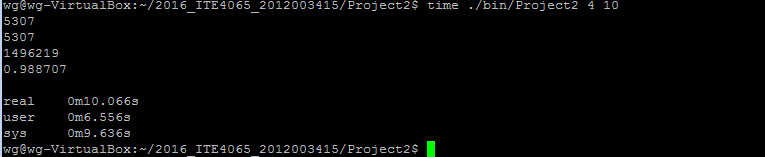
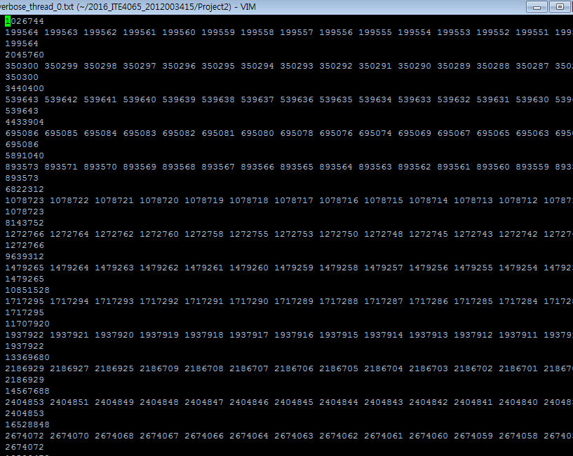
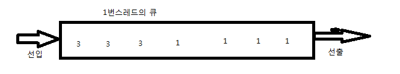
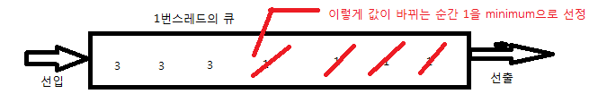
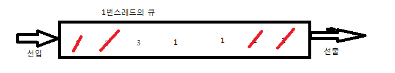
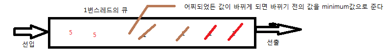
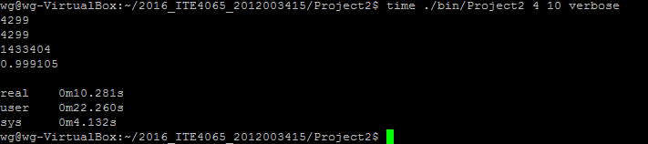
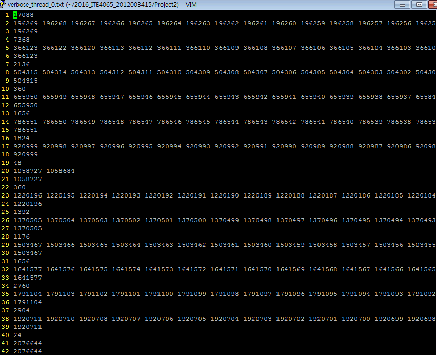
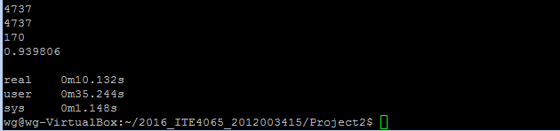
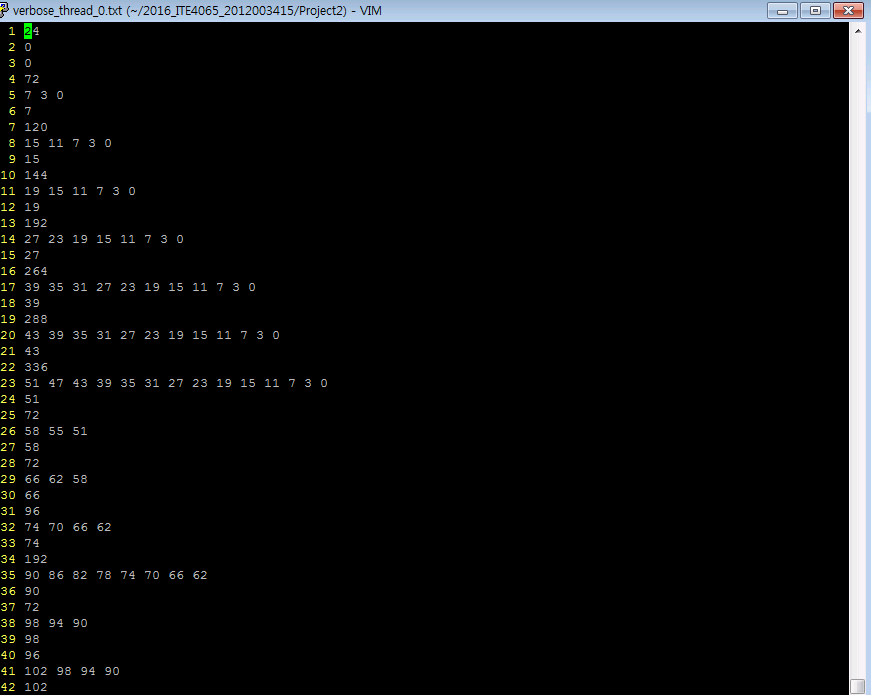

Simple MVCC 와 Garvage Collector
============
## 1. 소개
### 1.1 대략적인 진행
해당 프로그램은 대략적으로 다음과 같이 동작합니다. 
1. 각 스레드마다 A, B , version을 가지는 노드를 가지는 링크리스트를 가지고 최초실행시 랜덤으로 A와 B의 값을 설정해주고 version은 0으로 초기화해줍니다. 그리고 각각의 스레드들의 업데이트를 실행시키고 한 업데이트가 끝날때마다 version order를 atomic하게 증가시

2. 각각의 스레드 x는 다른 스레드 i를 참조하여 해당 스레드의 가장 최신 버전의 Ai값을 가져와서 내 스레드인 스레드 x의 A와B에 Ai를 더하고 빼는식으로 그리고 atomic한 version order를 함께 스레드 x의 링크리스트에 업데이트를 해줍니다.

3. 이를 duration동안 지속적으로 반복합니다.

- - -
### 1.2 프로그램이 Correctness하게 동작하기 위해 해야할 것들.
모든 스레드들이 동시에 돌면서 서로서로의 스레드를 참조해가며 업데이트를 해가기에 충돌이 발생합니다.
이를 위해서 다음과 같은 기법이 필요합니다.

**스레드 시작**

- 참조할 스레드 i를 선정함.

--------------임계영역 진입-----------------

- 글로벌 active리스트에 내 스레드 index와 버전을 삽입하고 현재 내가 업데이트중임을 알려줌.
- 글로벌 액티브리스트를 캡쳐

--------------임계영역 탈출-----------------

- 캡쳐된 리스트에 스레드i가 존재한다면, 거기 있는 버전보다 작은 것을 가져와서 업데이트를 진행하고 아니라면 그냥 업데이트 진행

--------------임계영역 진입-----------------

- 글로벌 active리스트에 내 스레드 index를 가진 노드를 제거함.

--------------임계영역 탈출-----------------

**스레드 끝**

이를 통해서 여러 스레드들이 동시에 Read와 Write를 진행하더라도 충돌을 방지 할 수 있습니다.

- - -
### 1.3 기타 유의할 것들.
- 다음과 같은 3개의 글로벌 플래그를 사용하여 verbose와 duration동안 스레드가 진행되는 것을 조정합니다.

` 
//이 플래그 true일때만 각 스레드들이 update를 진행할 수 있습니다. (duration동안 동작하도록 하기 위해 존재합니다.
volatile bool g_could_thread_run = true;
//이 플래그가 true라면 verbose옵션이 적용됩니다.
volatile bool g_verbose_flag = false;
//verbose옵션으로 인해 텍스트파일을 만드는 동안 다른 스레드들의 동작을 정지시킵니다.
volatile bool g_is_verbosing = false;
`

- 싱글리스트에 넣는 것을 역순으로 넣어서 성능을 향상시켰습니다. 이를 원래대로 넣을경우 약 10배가까이 성능의 차이가 있었습니다.

- - -
### 1.4 Garvage콜렉터와 락이 구현되지 않았을 경우의 결과 사진

verbose에 찍힌 값들은 사이즈는 점점 커져가고 가장 최신으로 업데이트된 값은 점차 증가하며 버전들은 모든 스레드에서 중복됨이 없이 점점 감소되면서 나타나게 됩니다.

* * *
## 2. Garvage Collector

Garvage Collector의 알고리즘은 다음과 같이 동작합니다. 일단 각 스레드별로 큐가 하나씩 있습니다.
그리고 그 큐에는 해당 스레드 x가 Active중이어서 다른 스레드가 해당 스레드x를 참조할 경우, 큐에 값을 하나씩 집어넣습니다.

이 큐에는 위와 같이 집어넣기 때문에 늘 캡쳐된 readview의 버전이 정렬이 되어있는체로 들어가게 됩니다. 
즉 위에 보이는 것처럼 해당 스레드x가 version order이 1일때 액티브중으로 들어갔다면 다른 스레드들은 이 스레드의 캡쳐된
리드뷰를 가져오게 될것이고 그 때마다 version order인 1이 x의 큐에 들어가게 될것입니다. 그러다가 해당 스레드가 업데이트 끝난 후
다시 다음 업데이트를 하게되어 version order이 3이 된다면 인제 x의 큐에는 3이 들어가게 됩니다. 

여기에서 아이디어를 착안하여 이렇게 1이 다 빠지게 되고 값이 바뀌는 그 순간에 minimum값을 1로 나두어서 
x의 리스트에서 1보다 작은 version을 가진것들을 전부 지울 수 있게 됩니다.

단 여기에서 주의해야 될 것은 큐에서 빠지게 되는 순서는 정해져있지 않고 1이 빠지다가 3이 빠지고 다시 1이 빠지는 
다음과 같이 빠질 수 있기에 

값이 바뀌는 그 순간의 바뀌기 전 값을 minimum으로 선정하여 삭제를 해줍니다.

다음은 결과사진입니다.

보시다시피 throuput이 garvage콜렉터를 적용하기 전보다는 약 9만개정도 갑소했습니다.

그러나 확실하게 각각의 스레드의 리스트의 크기는 줄어들게 되었습니다.

* * *
## 3. bakery lock

저는 락중 뭘 쓸까 고민하다가 베이커리 락을 직접 만들어서 사용하기로 했습니다.

` 
// declaration and initial values of global variables
    choosing: array [1..NUM_THREADS] of bool = {false};
    Number: array [1..NUM_THREADS] of integer = {0};
     
   lock(integer i) {
       choosing[i] = true;
       Number[i] = 1 + max(Number[1], ..., Number[NUM_THREADS]);
       choosing[i] = false;
       for (j = 1; j <= NUM_THREADS; j++) {
           // Wait until thread j receives its number:
           while (choosing[j]) { /* nothing */ }
           // Wait until all threads with smaller numbers or with the same
           // number, but with higher priority, finish their work:
          while ((Number[j] != 0) && ((Number[j], j) < (Number[i], i))) {
              /* nothing */
          }
      }
  }

  unlock(integer i) {
      Number[i] = 0;
  }

  Thread(integer i) {
      while (true) {
          lock(i);
          // The critical section goes here...
          unlock(i);
          // non-critical section...
      }
  }
`
베이커리 알고리즘의 수드코드

이를 사용했을 경우의 결과사진입니다. 

보시다시피 throuput이 어마어마하게 감소하였습니다.

이로 보아 소프트웨어적으로 락을 구현여 사용하는 것은 상당히 비효율적이 된다는 것을 알 수 있습니다. 
